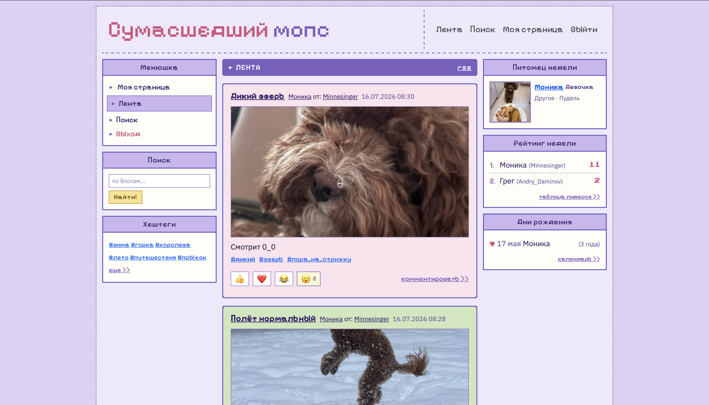
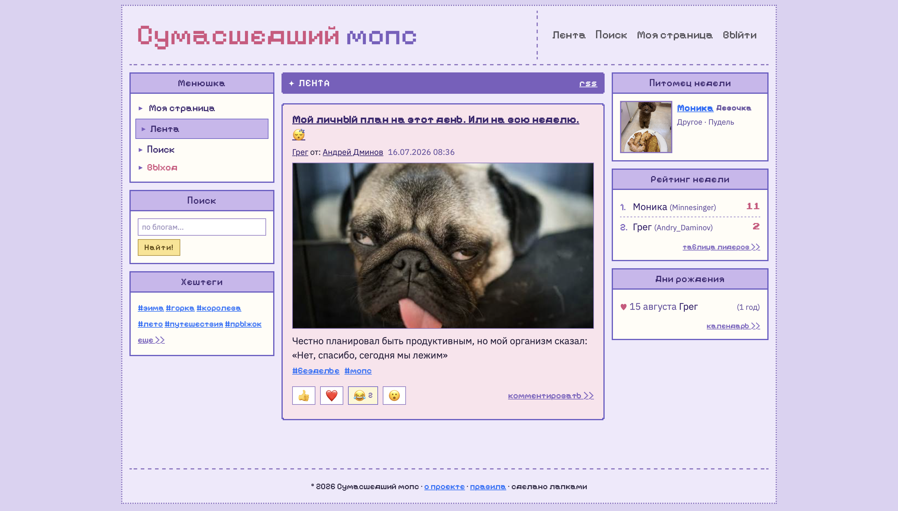
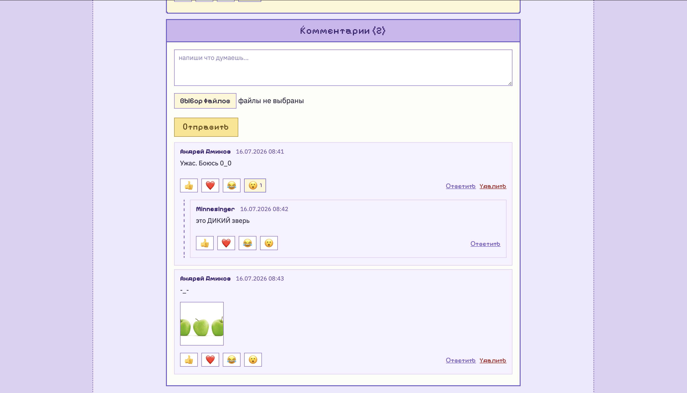
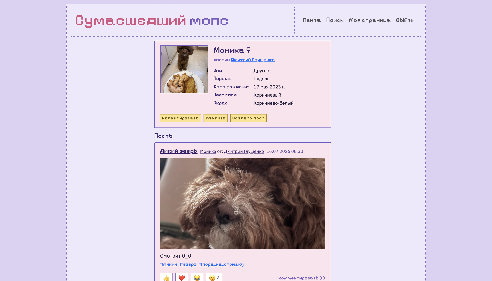
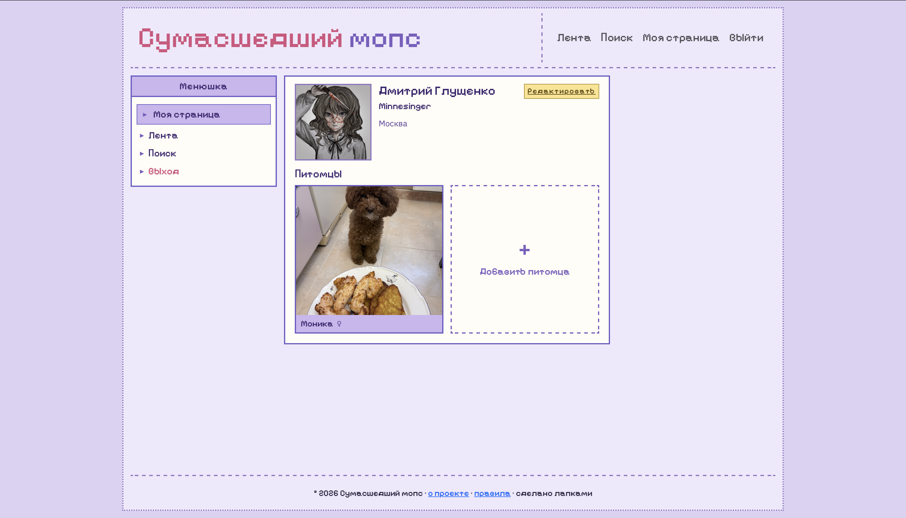
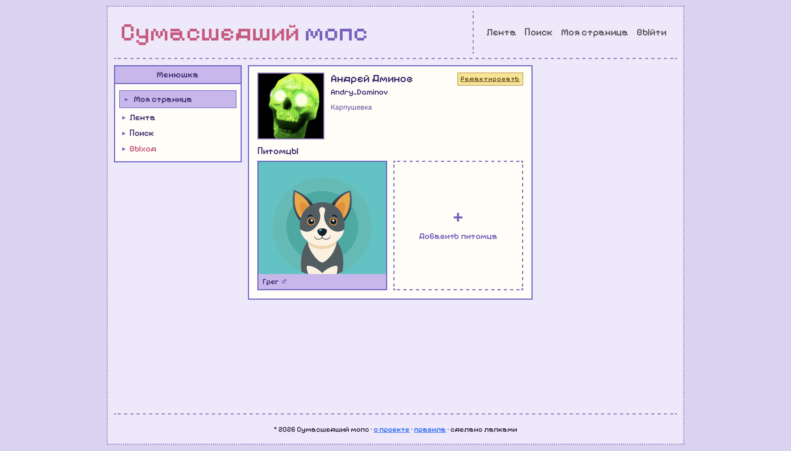
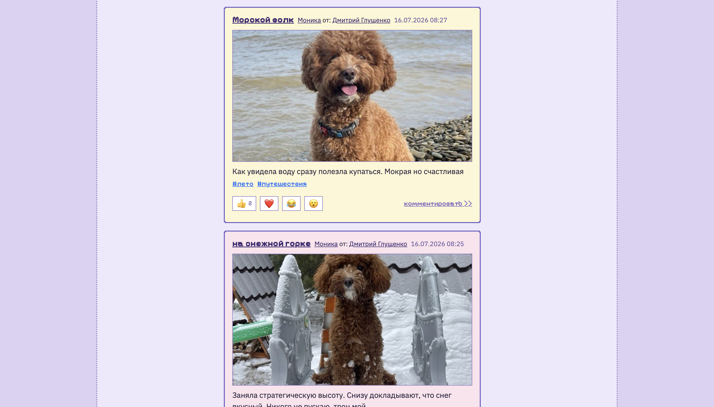
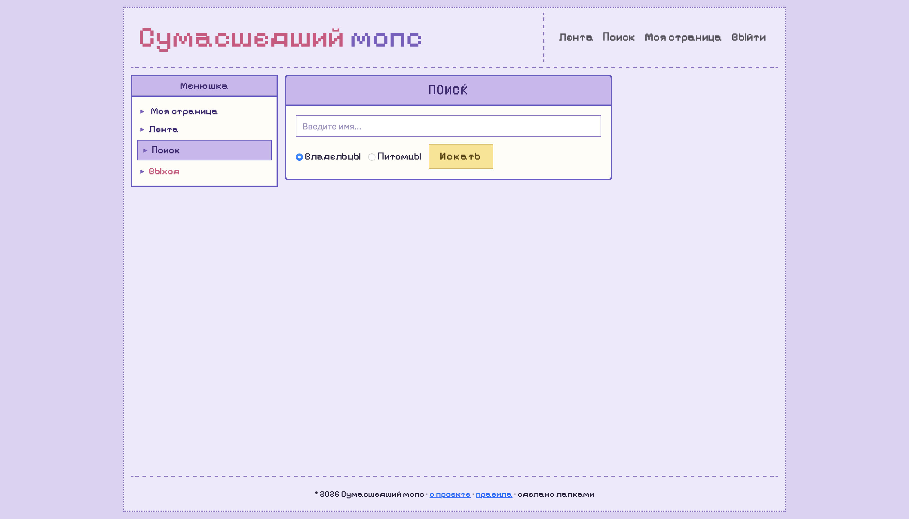

# crazy-mops
Внутренняя социальная сеть для общения вокруг домашних питомцев, поднятие настроения, укрепление командного духа.


## Описание идеи
### Название: 
#### ✨ **Сумасшедший мопс** ✨

### Проблема:
Почти все сотрудники компании имеют домашних питомцев и любят делиться их фотографиями с коллегами, однако в компании отсутствует единая платформа для такого общения. 

Существующие рабочие чаты и корпоративная почта перегружены производственными вопросами и не предоставляют специализированных механик для неформального взаимодействия. 

В результате сотрудники из разных отделов не имеют регулярных точек соприкосновения вне рабочих задач, а потенциал позитивных эмоциональных связей в коллективе остается нереализованным.

### Целевая аудитория:
Сотрудники компании всех уровней и стримов:

- Владельцы питомцев - хотят делиться радостью, получать признание и находить единомышленников
- Зрители - ищут легкий способ отвлечься, снять стресс и почувствовать себя частью сообщества
- Менеджеры - заинтересованы в укреплении командного духа и снижении уровня стресса в коллективе

Проект рассчитан на каждого сотрудника, независимо от наличия питомца - контент создают владельцы, а потребляют и поддерживают все.


### Основная ценность:
Внутренняя социальная платформа, решающая задачу горизонтальных коммуникаций в компании. Проект создает безопасное пространство для позитивного общения, где:

- Сотрудники из разных команд находят общие темы и узнают друг друга вне рабочих ролей
- Формируется привычка к регулярной обратной связи через комментарии и реакции
- Развивается эмпатия к коллегам через заботу о питомцах
- Снижается эмоциональное напряжение, укрепляется чувство принадлежности к единому сообществу

### Механизмы вовлечения и взаимодействия:
| Функция | Как это работает на командообразование? |
| ------- | ------ |
| Лента постов и комментарии | Ежедневная практика позитивной коммуникации |
| Реакции разных видов | Обратная связь тренирующая привычку давать признание и поддерживать друг друга |
| Недельный рейтинг питомцев| Элемент здоровой соревновательности |
| Календарь дней рождений | Напоминает о важных датах и создает поводы для поздравлений коллег |
| Забавные мини-игры | Легкие развлечения для перерывов, помогающие расслабится и разгрузить голову |

#### Дополнительные сценарии использования:
- Ежедневный ритуал - минутка милоты перед ежедневным скрамом - заход в ленту для позитивного настроя;
- Обсуждение новых постов или рейтингов как способ начать совещание в доброжелательной атмосфере;
- Разработчики, тестировщики, аналитики и менеджеры видят друг друга как живых людей;

### Визуальная концепция:
Проект выполняется в эстетике "Неовеб 2000х" - ламповый, пиксельный дизайн с элементами старых форумов. Ироничный и ностальгический стиль располагает к неформальному общению, подчеркивает, что это пространство для души, а не для работы.

---

## Команда

- Глущенко Дмитрий (minnesinger-sh)
- Алексей Зайцев (Yanotstatish)
- Бурындин Григорий (burindin235)
- Лимарев Степан (Satimov727)

## Развёртывание

1. Клонировать репозиторий:
```bash
   git clone https://github.com/Discrete-Mathematicians/crazy-mops.git
   cd crazy-mops
```
2. Создать и активировать виртуальное окружение. Рекомендуется Python 3.12
   (проект тестировался на нём) - на Python 3.13/3.14 обнаружена
   несовместимость шаблонизатора Django 4.2):
```bash
   python3.12 -m venv venv
   source venv/bin/activate
```
3. Установить зависимости:
```bash
   make install
```
4. Создать `.env` по образцу `.env.example`:
```bash
   cp .env.example .env
```
5. Поднять PostgreSQL (Docker):
```bash
   make db-up
```
6. Применить миграции и собрать статику:
```bash
   python manage.py migrate
   python manage.py collectstatic --noinput
```
7. Создать суперпользователя:
```bash
   python manage.py createsuperuser
```
8. Запустить сервер:
```bash
   make run
```

По умолчанию проект запускается с `DEBUG=false`; для разработки установите
`DJANGO_DEBUG=true` в `.env`.

## Тесты

```bash
make test        # прогон тестов
make test-cov    # с покрытием (порог 70%)
```

Текущее покрытие: 79%.

## Модели и связи

- **User** - кастомный пользователь (AbstractBaseUser, login/email уникальны)
- **Pet** - питомец/блог; `owner -> User` (у юзера несколько питомцев)
- **Post** - пост в блоге питомца; `pet -> Pet`
- **PostMedia / CommentMedia** - медиавложения; `-> Post / Comment`
- **Tag** - хештег; связь с Post через M2M (PostTag)
- **Comment** - комментарий; `post -> Post`, `user -> User`,
  `reply_comment -> Comment` (self, вложенные ответы)
- **Reaction** - реакция на пост ИЛИ комментарий (ровно одна цель,
  CHECK на уровне БД); уникальна на пару юзер+объект
- **Subscription** - подписка юзера на питомца; уникальная пара `user+pet`

ER-диаграмма: `docs/ER_diagram.md`

## Скриншоты










## Видео-демо

Ссылка будет добавлена к 16.07.2026

---


