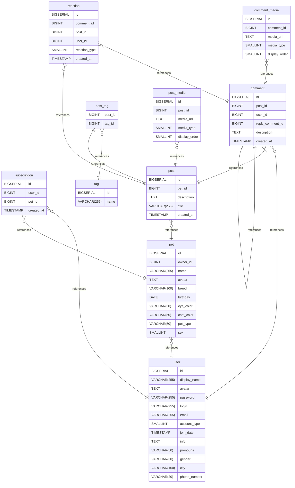

## Отношения

- **subscription to user**: many_to_one
- **pet to user**: many_to_one
- **post to pet**: many_to_one
- **comment to user**: many_to_one
- **comment_media to comment**: many_to_one
- **reaction to comment**: many_to_one
- **comment to post**: many_to_one
- **reaction to post**: many_to_one
- **post_tag to tag**: many_to_one
- **post_media to post**: many_to_one
- **post_tag to post**: one_to_one
- **subscription to pet**: many_to_one
- **comment to comment**: one_to_one

## ER-Диаграма

